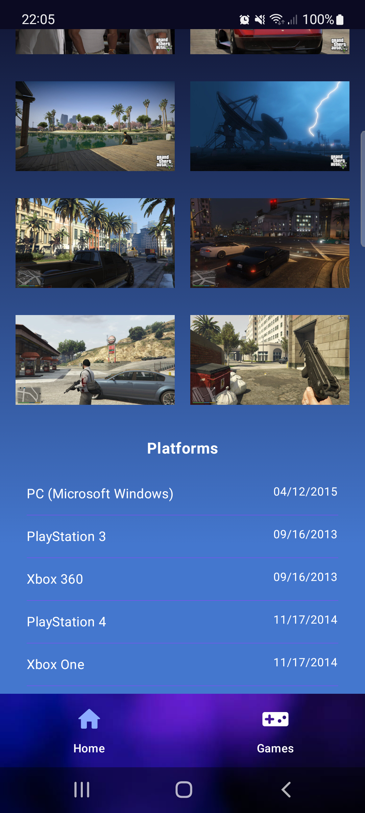
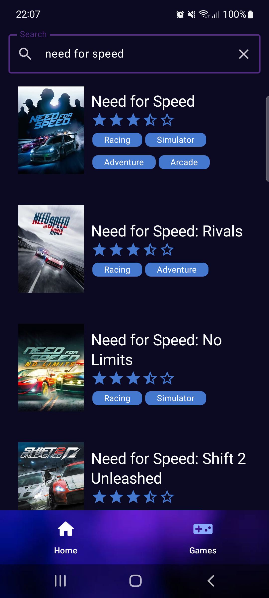

<a id="readme-top"></a>

<div align="center">
    
    <p align="center">
        Android Kotlin project of a video game viewer
    </p>
</div>

<details>
  <summary>Table of Contents</summary>
  <ol>
    <li>
      <a href="#about-the-project">About The Project</a>
      <ul>
        <li><a href="#built-with">Built With</a></li>
      </ul>
    </li>
    <li>
      <a href="#getting-started">Getting Started</a>
      <ul>
        <li><a href="#prerequisites">Prerequisites</a></li>
        <li><a href="#installation">Installation</a></li>
      </ul>
    </li>
    <li><a href="#usage">Usage</a></li>
    <li><a href="#architecture">Architecture</a></li>
    <li><a href="#license">License</a></li>
    <li><a href="#contact">Contact</a></li>
  </ol>
</details>


## About The Project

<div align="center">
    <table border=0>
        <tr>
            <td></td>
            <td></td>
            <td></td>
            <td></td>
            <td></td>
        </tr>
    </table>
</div>


Android project for a game and stream search app. This research project was built using Kotlin, Retrofit, and Jetpack Compose.

The goal of the project is to build a data visualizer for games. The app allows you to query data about games, search for games, and view the top Twitch streams for a given game.

The data is obtained through the Twitch and IGDB APIs.

<p align="right">(<a href="#readme-top">back to top</a>)</p>

### Built With

<table border=0>
    <tr>
        <td></td>
        <td></td>
        <td></td>
    </tr>
</table>

<p align="right">(<a href="#readme-top">back to top</a>)</p>

## Getting Started

The project is using Android Studio Koala

### Instalation

1. Clone the repo

```sh
git clone git@github.com:Danilo-Oliveira-Silva/weather-track.git
```

2. Altere o arquivo `/app/src/main/java/com/betrybe/arcadeatlas/core/di/ApiModule.kt` para definir as chaves de API da Twitch e IGDB.

```kotlin
fun provideApi() : ApiInterface {
        val baseUrl = "https://api.igdb.com/v4/"
        val bearerToken = "token-igdb"
        val clientId = "client-id-twitch"
}
```


```kotlin
 fun provideApiTwitch() : ApiInterfaceTwitch {
        val baseUrl = "https://api.twitch.tv/"
        val bearerToken = "token-twitch"
        val clientId = "client-id-twitch"
 }
 ```

## Usage

This project requires authentication on Twitch API.

<div align="center">
    <table border=0>
        <tr>
            <td></td>
            <td></td>
        </tr>
    </table>
</div>


<p align="right">(<a href="#readme-top">back to top</a>)</p>

## Architecture

This system works with several services for its operation:

- Auth API: This API was built in ASP.NET 6.0 using a layered architecture and Entity Framework Core to connect to a MySQL database, also in a Docker container. The repository pattern was used for database communication.

- Weather.API: This API, also built in ASP.NET, uses clean architecture. There are features to be developed, and not all will have the API as the presentation layer. Its infrastructure layer connects to a MongoDB database with a direct connection. The CQRS pattern and mediator were also used to invoke routes during its construction.

- Gateway API: Built in ASP.NET with the Ocelot package for routing, it serves as the single point of connection to other APIs in the container orchestration.

- WebApp: Front-end built with Angular 18 using components with Bootstrap 5.


<p align="right">(<a href="#readme-top">back to top</a>)</p>

## License

Distributed under the MIT License. See `LICENSE.txt` for more information.

<p align="right">(<a href="#readme-top">back to top</a>)</p>

## Contact

Danilo Silva

[](https://www.linkedin.com/in/danilodevs/)
[](https://www.iamdanilo.com/)
[](https://bsky.app/profile/danilodev.bsky.social)
[](mailto:danilo.o.s@hotmail.com)
[](https://dev.to/danilosilva)

<p align="right">(<a href="#readme-top">back to top</a>)</p>